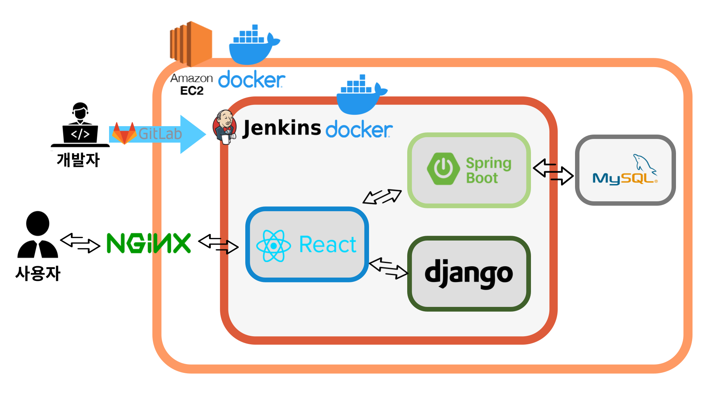

# BOOKIZ

## 목차

1. [**서비스 소개**](#1)
2. [**기술 스택**](#2)
3. [**시스템 아키텍처**](#3)
4. [**주요기능**](#4)
5. [**협업 관리**](#5)
6. [**개발 멤버 소개**](#6)
7. [**프로젝트 기간**](#7)
8. [**프로젝트 관련 문서**](#8)

 

## 💡 서비스 소개

BOOKIZ는 아이와 교감하면서 실감나게 동화를 읽어주는 서비스입니다.  
아이들에게 동화책을 직접 읽어줌으로써 얻을 수 있는 장점을 살리고, 동시에 부모님의 부담을 덜 수 있는 서비스를 기획하게 되었습니다.

 

## 🛠️ 기술 스택

 

 

 

 

 

## 🗂️ 시스템 아키텍처

## 🖥️ 기능

- 메인 페이지

  

- 도움말

  

- 검색하기

  

- 동화

  

 

## 👥 협업 관리

- Jira Burndown Chart

    

 

## 👪 BOOKIZ 개발 멤버 소개

👦**하미르**: 팀장, BE, STT

👩**김민지**: FE, 디테일 페이지

👨**김수환**: FE, 메인,목록 페이지

👱**이도경**: BE, TTS

👲**이종은**: BE, CI/CD

👶**최병성**: FE, 동화 진행 페이지

 

## 📆 프로젝트 기간

**2022.08.22~2022.10.07**

 

## 📁 프로젝트 관련 문서

|                   링크                   |
|:--------------------------------------:|
|  [포팅 매뉴얼](/exec/서울_1반_A103_포팅매뉴얼.pdf)  |
| [시연 시나리오](/exec/서울_1반_A103_시연시나리오.pdf) |
|   [발표자료](/exec/서울_1반_A103_발표자료.pptx)    |

